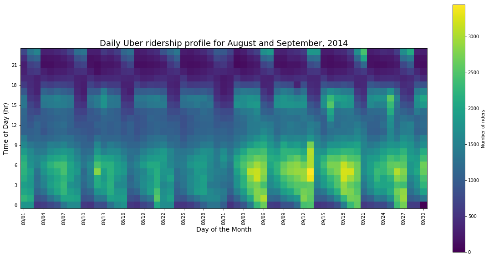

# Plot Review for Ben Steers (bs3639)

**Figure 1.** Daily Uber ridership profile for the month of August and September, 2014. There is a recurring peak at around 6am, presumably for the morning commute, and another around 5pm, just in time for the evening commute. There is also weekly periodicity, where the morning and evening commute patterns exist during the week, but stop for two day periods. Additionally, weekends see their peaks leading up to midnight implying that more people are out at most likely intoxicated so they need a ride home. None of this is at all unexpected behavior.

# Comments:
*CLARITY:* The plot is very simple and straight forward in presenting NYC Uber rides counts in different time spans of the day in a month. From the heat map we can clearly identify weekly recurring patterns, such as weekdays VS weekends. We can also see that there are peaks around last call (4 am) during the weekends.

*AESTHETIC:* The color of the plot helps reader to identify the temporal patterns in different time of the day and month. In terms of color blind friendliness, after running different simulations, this plot would work for most people. I kind of wish the day of the month could just be from 1 to 31, and maybe add additional vertical lines to separate each weeks. To better make a point to show the peak hours, maybe the y bar should run from 18:00 to 18:00 the second day, since night activity does not start from 0:00, and we can see at the top of the plots, there are yellow gradient that looks like it could be connected with the bottom gradient.

*HONESTY:* Over all the graph is honest in presenting Uber peak hours throughout the month without creating distortions.
